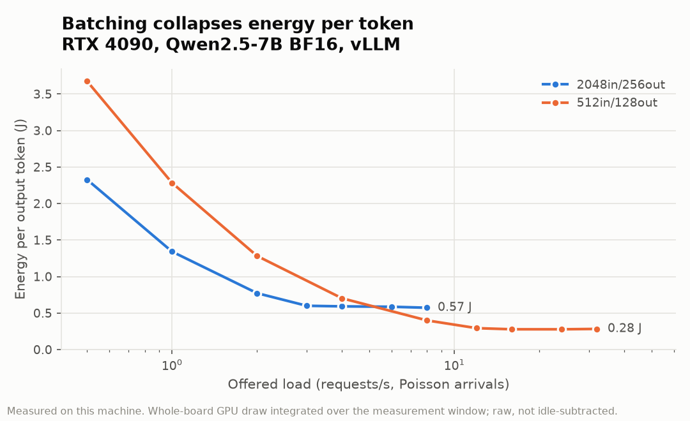
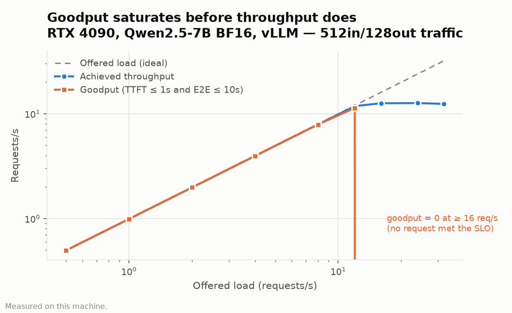
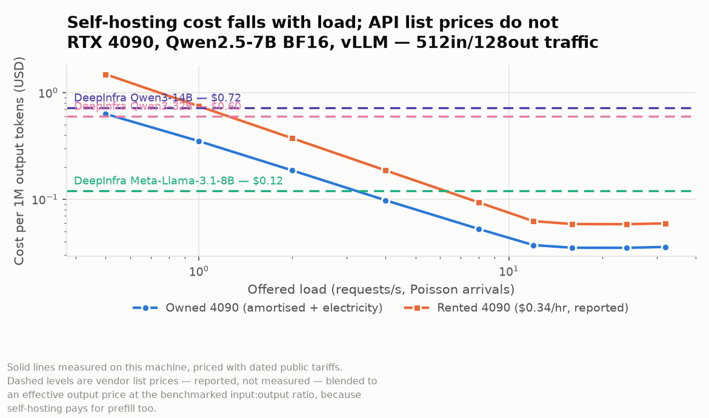

# WattBench

**What can one RTX 4090 actually serve, and at what volume does owning it beat
paying an API per token?**

Raw tokens-per-second tables for consumer GPUs exist in quantity. What is
missing is the layer above them: **goodput under an SLO, dollars per million
tokens, and joules per token as functions of offered load**, measured on
hardware people already own, with the harness and the raw data published so the
numbers can be checked.

That is what this repository is. Every measured value here traces to a
timestamped file in [`results/raw/`](results/raw/) produced on one machine.
Every external value — API price cards, GPU rental rates, the electricity
tariff — lives in [`pricing.yaml`](pricing.yaml) with a source and a date, and
is labelled *reported, not measured* wherever it appears. The two are never
blended.

> **Status.** Experiments are run in order E0 → E3, then the economics memo.
> Sections below are filled in from committed raw data as each completes;
> anything not yet measured says **not run** rather than carrying an estimate.

---

## Prior art, and what is missing from it

- **[InferenceMAX / InferenceX](https://inferencemax.ai/) (SemiAnalysis).**
  Continuous, open-source inference benchmarking with tokens-per-dollar and
  tokens-per-watt metrics, on datacenter hardware (B200/GB200/MI355X-class) and
  large models. It legitimises the economics framing and supplies the
  vocabulary this project borrows. It does not touch consumer cards or
  ownership economics.
- **Consumer-GPU benchmark collections** — `XiongjieDai/GPU-Benchmarks-on-LLM-Inference`,
  `hholtmann/llm-consumer-gpu-benchmark`, hardware-corner's llama-bench tables,
  the various Ollama benchmark posts. These report tokens/s for single requests
  or one fixed concurrency. Almost none sweep offered load, essentially none
  report goodput under a stated SLO, and none measure energy per token under
  batching or derive API break-even volumes.
- **Per-query energy analyses.** Mostly modelled, or measured datacenter-side.
  A measured J/token-versus-load curve on owned hardware is largely absent.

**The niche, in one line:** *load-dependent economics — goodput, $/1M tokens,
J/token as functions of offered load — on hardware people own, reproducibly.*

---

## What was measured

| | |
|---|---|
| Hardware | 1 × NVIDIA GeForce RTX 4090, 24 GB, in a Windows desktop |
| Serving | vLLM 0.26.0 under WSL2 (Ubuntu 26.04), driver 595.95 |
| Models | Qwen2.5-Instruct, 1.5B → 32B, BF16 and int4 |
| Shapes | chat (512 in / 128 out) and RAG (2048 in / 256 out) |
| Arrivals | Poisson, fixed seed, 0.5 → 32 req/s |
| SLO | TTFT ≤ 1 s **and** end-to-end ≤ 10 s |
| Energy | GPU-rail draw polled at ~2 Hz, integrated trapezoidally to joules |

Full protocol and its limits: [`METHODOLOGY.md`](METHODOLOGY.md).
Reproducing it on Windows: [`SETUP-WSL2.md`](SETUP-WSL2.md).
Verified machine inventory: [`results/environment.md`](results/environment.md).

---

## Headline results

Full tables in [`results/tables/`](results/tables/); every figure traces to a
timestamped file in [`results/raw/`](results/raw/).

### 1. Batching collapses cost and energy per token

Qwen2.5-7B BF16, chat shape (512 in / 128 out), Poisson arrivals:

| offered req/s | out tok/s | J / output token | mean batch | KV util | goodput req/s |
|---|---|---|---|---|---|
| 0.5 | 63.7 | 3.67 | 1.0 | 0.5% | 0.50 |
| 2 | 253.2 | 1.28 | 4.5 | 2.3% | 1.98 |
| 8 | 1012 | 0.399 | 27.8 | 14.2% | 7.91 |
| **12** | **1515** | **0.293** | 82 | 42% | **11.4** |
| 16 | 1614 | 0.277 | 170 | 87% | **0** |
| 32 | 1591 | 0.283 | 167 | 85% | **0** |

**Energy per token falls 13×** between 0.5 and 16 req/s. Nothing about the card
changed — batching amortises the weight-bandwidth cost that dominates decode.



### 2. Goodput falls off a cliff where throughput doesn't

Past saturation throughput degrades *gracefully* — 12.6 → 12.65 → 12.43 req/s —
while goodput goes to **exactly zero**: TTFT p95 reaches 35–108 seconds and the
server preempts 239–267 times per run. A throughput-only benchmark reports this
server as healthy at 32 req/s. It is unusable.



**Max sustainable rate under the SLO** (TTFT ≤ 1 s, e2e ≤ 10 s): **12 req/s**
chat, **2 req/s** RAG (2048 in / 256 out).

### 3. Cost per 1M output tokens, and break-even

At the best SLO-meeting point measured (12 req/s, 1515 tok/s sustained):

| Line | $/1M output tokens |
|---|---|
| Electricity only (marginal) | $0.023 |
| Card amortisation, 3 yr, 100% duty | $0.015 |
| **Owned hardware, total** | **$0.037** |
| Hypothetical rental (RunPod 4090, $0.34/hr, *reported*) | $0.062 |



Break-even against hosted APIs, blended to an effective output price at the
benchmarked 4:1 input:output ratio — **all API prices reported, not measured**:

| API | comparable weight class | effective $/1M out | break-even |
|---|---|---|---|
| DeepInfra Llama-3.1-8B | yes | $0.120 | 19.7M tok/day (15% of capacity) |
| DeepInfra Qwen3-14B | yes | $0.720 | 2.75M tok/day (2%) |
| Together Qwen2.5-7B | yes | $1.500 | 1.30M tok/day (<1%) |
| Anthropic Haiku 4.5 | **no** | $9.000 | 213k tok/day (<1%) |

**The card pays for itself at ~1.3M output tokens/day against the closest
like-for-like hosted option** — under 1% of what it can actually serve. Even
against the cheapest hosted small model on the list, break-even is 15% duty
cycle. The amortisation line assumes the card is busy at 1515 tok/s every hour
of three years; at 10% duty cycle the amortised component is 10× higher.

### 4. What int4 buys on 24 GB

| | BF16 | AWQ int4 |
|---|---|---|
| ITL p50 @ 2 req/s | 16.75 ms | **6.46 ms** |
| J/token @ 2 req/s | 1.28 | **1.08** (−16%) |
| J/token @ 8 req/s | 0.383 | 0.374 (−2%) |
| KV per concurrent request | ~0.58% | **~0.23%** |
| Concurrency before preemption | **~170** | **~435** |
| Preemptions @ 256 concurrent | 245 | **0** |
| Longest servable context | 32,768 | 32,768 |
| GSM8K (50 items) | 96.0% | 92.0% |

Int4's advantage is **load-dependent**: large at low load, nearly gone at
mid load. Batching and quantization attack the same bottleneck, so whichever is
applied first captures most of the gain.

**Two results that contradict expectations, reported rather than smoothed:**

- **Int4 does not extend servable context here.** Both formats cap at exactly
  32,768 — the checkpoints' `max_position_embeddings`. The ceiling is
  architectural, not memory-bound, despite AWQ holding 2.6× the KV cache. Int4's
  memory converts into *concurrent requests*, not longer ones.
- **AWQ and GPTQ are indistinguishable** (ITL within 1.3%). vLLM routes both
  through the same Marlin kernel, so on this stack the checkpoint format is
  packaging rather than performance.

The quality guard is 50 items with heavily overlapping intervals: it rules out a
quality collapse and **cannot certify parity**.

### 5. Model-size frontier

Every rung is AWQ int4, same serving flags, same 4 req/s of 512-in/128-out — so
offered load is fixed at 512 tok/s and the only variable is model size. Size
therefore does not buy throughput here; it spends power, latency and energy.

| model | ctx | out tok/s | SLO met | TTFT p95 | ITL p95 | mean W | J/token |
|---|---|---|---|---|---|---|---|
| 1.5B | 4096 | 511.1 | 100% | 42.9 ms | 4.24 ms | 182.9 | 0.371 |
| 3B | 4096 | 510.6 | 100% | 58.9 ms | 12.5 ms | 227.0 | 0.461 |
| 7B | 4096 | 509.8 | 100% | 111.3 ms | 9.40 ms | 319.7 | 0.650 |
| 14B | 4096 | 507.7 | 100% | 368.4 ms | 100.3 ms | 369.2 | 0.752 |
| 32B | 4096 | — | — | — | — | — | — |
| 32B | 1024 | **109.9** | **0.5%** | **693 s** | 23.4 ms | 370.7 | **3.40** |

**Everything up to 14B holds the load; 32B does not come close.** From 1.5B to
14B, 9.3× the parameters costs only **2.0× the energy per token** (0.371 →
0.752 J) — sublinear, because at this load fixed overhead dominates. Latency is
what degrades first: ITL p95 rises **23.7×** over the same range while energy
merely doubles.

**32B is a different regime, not a further step along the curve.** At its
reduced 1024-token context it serves 109.9 of the 512 tok/s offered, meets the
SLO on 0.5% of requests, and burns **4.5× the energy per token of 14B**. Its
ITL p95 is 23.4 ms — *lower* than 14B's. Decode is not the problem. The KV
cache runs at 86% mean and 100% peak, 388 requests are preempted and recomputed,
and the queue reaches 626 deep. The collapse is entirely queueing.

**Two results that contradict expectations, reported rather than smoothed:**

- **32B's servable context is not a number, it is a coin flip.** 18.14 GiB of
  int4 weights leaves too little of the 21.6 GiB budget for KV, but *how much*
  too little moves between identical invocations: vLLM's CUDA-graph memory
  estimate measured 0.62, 0.86, 1.59 and 7.34 GiB on the same flags. So 4096
  failed, then served, then failed; 1024 completed a full 800-prompt run, then
  failed in a later probe; only 512 served on every attempt. Reporting a single
  "longest servable context" for 32B would be false precision, so this reports
  the distribution instead. Every attempt is committed in `results/raw/`.
- **The 4090's model-size ceiling at this load sits between 14B and 32B**, and
  it is set by memory, not by compute. 14B still serves 32,768-token context —
  the same architectural cap the 7B rung hits in both precisions — while 32B
  cannot reliably hold 1024.

Full table, including the failed rungs and the root cause read from each
server's own log: [`results/tables/e3_frontier.md`](results/tables/e3_frontier.md).

No GSM8K guard was run for these checkpoints, so this section makes **no claim
about output quality** at any size — only about what the card can serve.

## Run-to-run variance — the bar every other number carries

Before any comparison is claimed, the same reference configuration is run three
times and its coefficient of variation reported. Differences smaller than that
CV are noise, and this project does not claim them.

See [`results/tables/e0_variance.md`](results/tables/e0_variance.md).

---

## Reproducing

```bash
uv venv --python 3.12 ~/wattbench-venv
VIRTUAL_ENV=~/wattbench-venv uv pip install vllm pyyaml matplotlib

./fetch_models.sh                     # pre-fetch weights (hours, at ~3 MB/s)
./baseline.sh E1-chat                 # fresh idle-power baseline, GPU quiet
./sweep.sh --series E1-chat configs/e1/chat/*.yaml
# The other scripts resolve the venv themselves; this one runs on whatever
# python3 is on PATH, and the system one has no matplotlib.
~/wattbench-venv/bin/python ./analyze.py all   # tables + plots into results/
```

`run.sh` takes one config and produces one raw result; it reuses a running vLLM
server across points that share serving flags, and skips points that already
have a result, so an interrupted sweep resumes rather than restarts.

Two environment variables are set for every run because vLLM 0.26 will not
otherwise start under WSL2 — `VLLM_USE_V2_MODEL_RUNNER=0` and
`VLLM_USE_FLASHINFER_SAMPLER=0`. Both are explained in
[`SETUP-WSL2.md`](SETUP-WSL2.md), and both mean **these throughput numbers
should not be compared against published vLLM figures from a native-Linux
host.**

---

## What this does not claim

- **No capability equivalence.** A locally served Qwen2.5-7B is not a substitute
  for a frontier API model. Frontier prices appear in the comparison to show the
  ceiling of the market, marked as not weight-class comparable. The only
  capability evidence produced here is a 50-item GSM8K exact-match guard, which
  licenses no claim beyond that task — and at n=50 the 95% interval is roughly
  ±14 points, so only large gaps mean anything.
- **No measured API latency.** Without API keys, no hosted endpoint was timed.
  Every measured latency here is self-hosted.
- **No datacenter comparison.** One consumer card; datacenter work is cited, not
  reproduced.
- **GPU rail only.** Host power (CPU, RAM, PSU losses) is not measured, so a
  wall-socket figure would be higher than the J/token reported here.
- **One card, no failover, no ops budget.** The cost model prices silicon and
  electricity. It does not price your time, downtime, or the absence of a
  second machine.

---

## Layout

```
configs/        one YAML per experiment point
run.sh          config in -> one raw result out; resumable
sweep.sh        run a list of points unattended, baseline first
baseline.sh     measure the idle-power baseline for a series
power_log.py    telemetry polling and joule integration
harness.py      config parsing, provenance, result assembly, sanity checks
validate_energy.py  M3 gate: energy numbers are checked before they are used
gsm8k_guard.py  50-item quality guard for the quantization ablation
probe_limits.sh longest servable context per checkpoint
analyze.py      raw -> tables and plots
pricing.yaml    dated external data, all reported-not-measured
results/raw/    committed raw output, append-only
results/idle/   idle-power baselines, one per series
```
